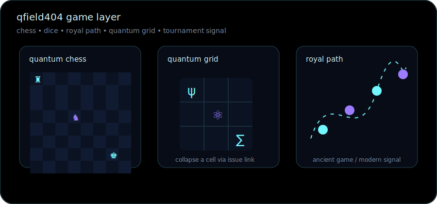

<div align="center">


<br><br>


<br><br>


</div>

---

## 🧬 Field profile

`qfield404` is a quiet technical node for automation, data systems and operational logic.

Built around one principle: convert noisy workflows into clear signals, then turn those signals into useful tools.

```txt
alias        qfield404
state        hidden
domain       automation · data · systems · signals
method       observe → model → automate → measure
rule         low noise / high signal
```

---

## 🪐 System orbit

| Layer | Function |
|---|---|
| 🧲 Field | map invisible patterns in messy workflows |
| ⚛️ Particle | break problems into small controllable units |
| 📡 Signal | extract useful data from operational noise |
| 🛰️ Orbit | keep systems stable, traceable and repeatable |
| 🌌 Void | remove unnecessary complexity |

---

## 📡 Telemetry

<div align="center">


</div>

```txt
observe
  ↓
model
  ↓
automate
  ↓
measure
  ↓
stabilize
  ↓
iterate
```

---

## 🛠️ Instruments

<div align="center">


</div>

---

## 🐍 Contribution field

<div align="center">

<picture>
  <source media="(prefers-color-scheme: dark)" srcset="../../raw/output/github-contribution-grid-snake-dark.svg">
  <source media="(prefers-color-scheme: light)" srcset="../../raw/output/github-contribution-grid-snake.svg">
  
</picture>

</div>

---

## 🎮 Quantum game mode

<div align="center">



</div>

### 1. Quantum chess

A lightweight README chess board inspired by open chess profiles. Moves are submitted as issues; the board is intentionally static for now.

| Action | Issue command |
|---|---|
| [♜ Move rook](https://github.com/qfield404/qfield404/issues/new?title=chess%7Cmove-rook&body=piece:%20rook%0Afrom:%20a1%0Ato:%20a4) | `chess: rook a1 → a4` |
| [♞ Move knight](https://github.com/qfield404/qfield404/issues/new?title=chess%7Cmove-knight&body=piece:%20knight%0Afrom:%20b1%0Ato:%20c3) | `chess: knight b1 → c3` |
| [♚ Protect core](https://github.com/qfield404/qfield404/issues/new?title=chess%7Cprotect-core&body=piece:%20king%0Aaction:%20protect%20core) | `chess: protect core` |

### 2. Quantum RPG roll

Choose a particle class and roll a state.

| Particle class | Roll |
|---|---|
| [⚛ Photon](https://github.com/qfield404/qfield404/issues/new?title=roll%7Cphoton&body=class:%20photon%0Aaction:%20collapse%20wavefunction) | speed / signal / light |
| [🧲 Quark](https://github.com/qfield404/qfield404/issues/new?title=roll%7Cquark&body=class:%20quark%0Aaction:%20bind%20state) | structure / force / matter |
| [🌌 Neutrino](https://github.com/qfield404/qfield404/issues/new?title=roll%7Cneutrino&body=class:%20neutrino%0Aaction:%20pass%20through%20noise) | stealth / void / hidden state |

```txt
d20 quantum roll
01-07  noisy state
08-14  stable orbit
15-19  coherent signal
20     field collapse: critical insight
```

### 3. Royal game of fields

A small path game inspired by the Royal Game of Ur. Each issue advances a signal through the field.

| Path | Action |
|---|---|
| [Ⅰ Enter field](https://github.com/qfield404/qfield404/issues/new?title=ur%7Center-field&body=path:%20I%0Astate:%20enter%20field) | initialize signal |
| [Ⅱ Cross orbit](https://github.com/qfield404/qfield404/issues/new?title=ur%7Ccross-orbit&body=path:%20II%0Astate:%20cross%20orbit) | move through uncertainty |
| [Ⅲ Exit void](https://github.com/qfield404/qfield404/issues/new?title=ur%7Cexit-void&body=path:%20III%0Astate:%20exit%20void) | stabilize result |

### 4. Quantum tic-tac-toe

Pick a cell and collapse it.

|   |   |   |
|---|---|---|
| [A1](https://github.com/qfield404/qfield404/issues/new?title=grid%7CA1&body=cell:%20A1%0Astate:%20collapse) | [A2](https://github.com/qfield404/qfield404/issues/new?title=grid%7CA2&body=cell:%20A2%0Astate:%20collapse) | [A3](https://github.com/qfield404/qfield404/issues/new?title=grid%7CA3&body=cell:%20A3%0Astate:%20collapse) |
| [B1](https://github.com/qfield404/qfield404/issues/new?title=grid%7CB1&body=cell:%20B1%0Astate:%20collapse) | [B2](https://github.com/qfield404/qfield404/issues/new?title=grid%7CB2&body=cell:%20B2%0Astate:%20collapse) | [B3](https://github.com/qfield404/qfield404/issues/new?title=grid%7CB3&body=cell:%20B3%0Astate:%20collapse) |
| [C1](https://github.com/qfield404/qfield404/issues/new?title=grid%7CC1&body=cell:%20C1%0Astate:%20collapse) | [C2](https://github.com/qfield404/qfield404/issues/new?title=grid%7CC2&body=cell:%20C2%0Astate:%20collapse) | [C3](https://github.com/qfield404/qfield404/issues/new?title=grid%7CC3&body=cell:%20C3%0Astate:%20collapse) |

### 5. Field tournament

Community moves can become a small tournament log later. For now, every move is just an issue signal.

[📡 Submit field move](https://github.com/qfield404/qfield404/issues/new?title=tournament%7Cfield-move&body=move:%20%0Areason:%20%0Aexpected_signal:%20)


---

## 🌠 Active signals

- workflow automation
- local-first utilities
- data cleaning and dashboards
- SQLite-backed prototypes
- process mapping
- audit-friendly records
- AI-assisted documentation
- operational intelligence experiments

---

<div align="center">


</div>
