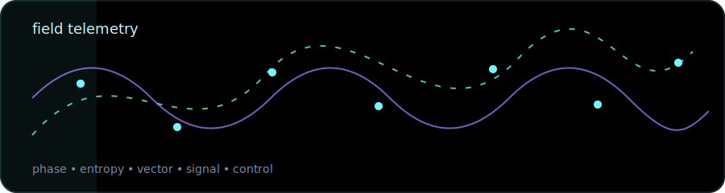

<div align="center">


<br><br>



<br><br>


</div>

---

## 🧬 Field profile

`qfield404` is a quiet technical node for automation, data systems and operational logic.

Built around one principle: convert noisy workflows into clear signals, then turn those signals into useful tools.

```txt
alias        qfield404
state        hidden
domain       automation · data · systems · signals
method       observe → model → automate → measure
rule         low noise / high signal
```

---

## 🪐 System orbit

| Layer | Function |
|---|---|
| 🧲 Field | map invisible patterns in messy workflows |
| ⚛️ Particle | break problems into small controllable units |
| 📡 Signal | extract useful data from operational noise |
| 🛰️ Orbit | keep systems stable, traceable and repeatable |
| 🌌 Void | remove unnecessary complexity |

---

## 📡 Telemetry

<div align="center">



</div>

```txt
observe
  ↓
model
  ↓
automate
  ↓
measure
  ↓
stabilize
  ↓
iterate
```

---

## 🛠️ Instruments

<div align="center">


</div>

---

## 🐍 Contribution field

<div align="center">

<picture>
  <source media="(prefers-color-scheme: dark)" srcset="../../raw/output/github-contribution-grid-snake-dark.svg">
  <source media="(prefers-color-scheme: light)" srcset="../../raw/output/github-contribution-grid-snake.svg">
  
</picture>

</div>

---

## 🌠 Active signals

- workflow automation
- local-first utilities
- data cleaning and dashboards
- SQLite-backed prototypes
- process mapping
- audit-friendly records
- AI-assisted documentation
- operational intelligence experiments

---

<div align="center">


</div>
