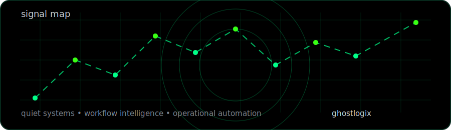

<div align="center">


<br><br>



<br><br>


</div>

---

## 🕶️ Profile

`ghostlogix` is a quiet digital workspace for automation, data, operational logic and useful systems.

No noise. No spotlight. Just tools, patterns and experiments built to make repetitive work easier, clearer and more controlled.

```txt
identity      ghostlogix
mode          quiet-ops
stack         python · javascript · node · sqlite · excel · bi
interest      automation · dashboards · local systems · process intelligence
principle     simple tools > complex promises
```

---

## ⚙️ Operating map

| Layer | Signal |
|---|---|
| 🧠 Logic | mapping messy workflows into clear rules |
| ⚙️ Automation | reducing repetitive/manual steps |
| 📊 Data | turning records into useful indicators |
| 🗄️ Systems | keeping history, structure and traceability |
| 🧪 Experiments | testing small ideas before building big things |

---

## 🧬 System loop

```txt
observe
  ↓
understand
  ↓
automate
  ↓
measure
  ↓
improve
  ↓
repeat
```

<div align="center">



</div>

---

## 🧰 Toolkit

<div align="center">


</div>

---

## 🐍 Contribution snake

<div align="center">

<picture>
  <source media="(prefers-color-scheme: dark)" srcset="https://raw.githubusercontent.com/joaolucas2018com-design/joaolucas2018com-design/output/github-contribution-grid-snake-dark.svg">
  <source media="(prefers-color-scheme: light)" srcset="https://raw.githubusercontent.com/joaolucas2018com-design/joaolucas2018com-design/output/github-contribution-grid-snake.svg">
  
</picture>

</div>

---

## 🟩 Signal board

<div align="center">


<br>


</div>

---

## 🧪 Current signals

- workflow automation
- local-first tools
- data cleaning and operational dashboards
- SQLite-backed prototypes
- process mapping and audit-friendly records
- AI-assisted documentation and internal utilities

---

<div align="center">


`quiet systems. useful signals. no unnecessary noise.`


</div>
